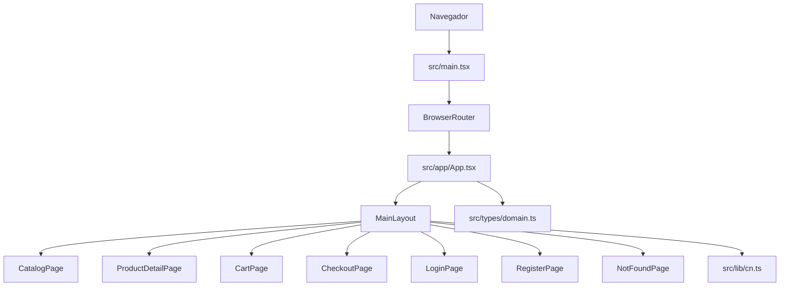
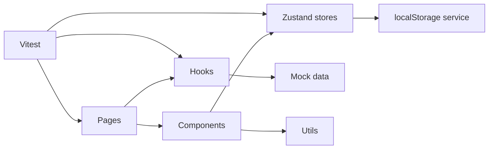

# Arquitectura

## Arquitectura actual

La aplicación actual es una SPA con React Router, un layout principal y páginas por ruta. El repositorio ya incluye configuración de Vite, TypeScript, Tailwind, ESLint, Prettier y Vitest.



## Estructura actual

```text
src/
  app/
    App.tsx
    layouts/MainLayout.tsx
  lib/
    cn.ts
  pages/
    CatalogPage.tsx
    ProductDetailPage.tsx
    CartPage.tsx
    CheckoutPage.tsx
    LoginPage.tsx
    RegisterPage.tsx
    NotFoundPage.tsx
  styles/index.css
  test/setup.ts
  types/domain.ts
```

## Evolución propuesta



## Módulos

| Módulo | Descripción | Prioridad | Complejidad |
| --- | --- | --- | --- |
| Routing | Rutas base, navegación y página 404. | Alta | Baja |
| UI | Layout, tarjetas, formularios y responsive. | Alta | Media |
| Catálogo | Productos mock, listado y detalle. | Alta | Media |
| Búsqueda | Filtrado por texto. | Alta | Baja |
| Filtros | Categoría, marca, precio, stock y características. | Alta | Media |
| Autenticación | Registro, login y sesión local. | Alta | Media |
| Estado global | Stores de auth y carrito con Zustand. | Alta | Media |
| Carrito | Items, cantidades, stock, subtotales y total. | Alta | Alta |
| Persistencia | localStorage para usuario y carrito. | Media | Media |
| Testing | Pruebas de filtros, stores y rutas. | Media | Media |

## Rutas

| Ruta | Página | Estado |
| --- | --- | --- |
| `/` | Catálogo | Placeholder funcional |
| `/products/:productId` | Detalle | Placeholder funcional |
| `/cart` | Carrito | Placeholder funcional |
| `/checkout` | Checkout | Placeholder funcional |
| `/login` | Login | Placeholder funcional |
| `/register` | Registro | Placeholder funcional |
| `*` | 404 | Basica implementada |

## Decision de arquitectura

El proyecto mantiene una arquitectura frontend simple y modular. No se introduce backend ni capas artificiales porque el alcance académico exige una tienda simulada con datos locales. La separación propuesta por componentes, stores, hooks, data y utilidades es suficiente para sostener seis semanas de evolución sin sobreingeniería.
