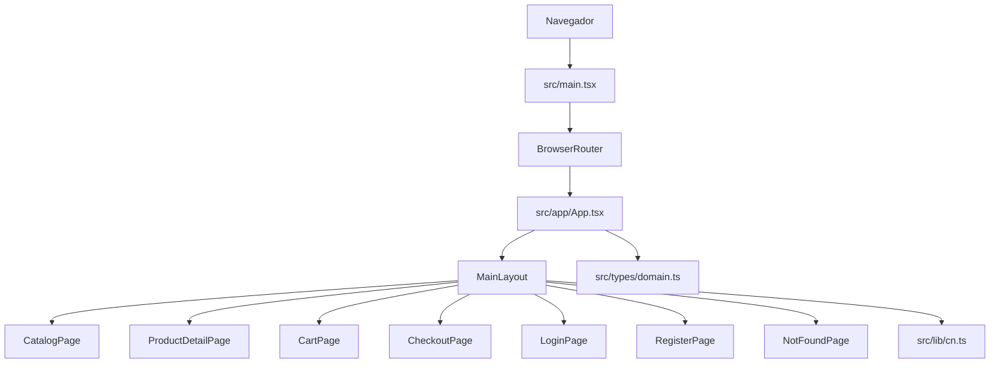
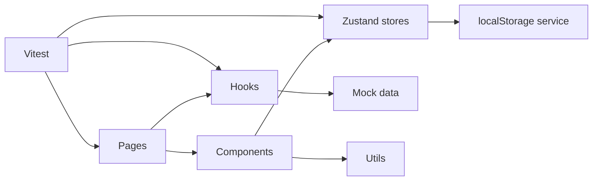

# Arquitectura

## Arquitectura actual

La aplicacion actual es una SPA con React Router, un layout principal y paginas por ruta. El repositorio ya incluye configuracion de Vite, TypeScript, Tailwind, ESLint, Prettier y Vitest.



## Estructura actual

```text
src/
  app/
    App.tsx
    layouts/MainLayout.tsx
  lib/
    cn.ts
  pages/
    CatalogPage.tsx
    ProductDetailPage.tsx
    CartPage.tsx
    CheckoutPage.tsx
    LoginPage.tsx
    RegisterPage.tsx
    NotFoundPage.tsx
  styles/index.css
  test/setup.ts
  types/domain.ts
```

## Evolucion propuesta



## Modulos

| Modulo | Descripcion | Prioridad | Complejidad |
| --- | --- | --- | --- |
| Routing | Rutas base, navegacion y pagina 404. | Alta | Baja |
| UI | Layout, tarjetas, formularios y responsive. | Alta | Media |
| Catalogo | Productos mock, listado y detalle. | Alta | Media |
| Busqueda | Filtrado por texto. | Alta | Baja |
| Filtros | Categoria, marca, precio, stock y caracteristicas. | Alta | Media |
| Autenticacion | Registro, login y sesion local. | Alta | Media |
| Estado global | Stores de auth y carrito con Zustand. | Alta | Media |
| Carrito | Items, cantidades, stock, subtotales y total. | Alta | Alta |
| Persistencia | localStorage para usuario y carrito. | Media | Media |
| Testing | Pruebas de filtros, stores y rutas. | Media | Media |

## Rutas

| Ruta | Pagina | Estado |
| --- | --- | --- |
| `/` | Catalogo | Placeholder funcional |
| `/products/:productId` | Detalle | Placeholder funcional |
| `/cart` | Carrito | Placeholder funcional |
| `/checkout` | Checkout | Placeholder funcional |
| `/login` | Login | Placeholder funcional |
| `/register` | Registro | Placeholder funcional |
| `*` | 404 | Basica implementada |

## Decision de arquitectura

El proyecto mantiene una arquitectura frontend simple y modular. No se introduce backend ni capas artificiales porque el alcance academico exige una tienda simulada con datos locales. La separacion propuesta por componentes, stores, hooks, data y utilidades es suficiente para sostener seis semanas de evolucion sin sobreingenieria.
