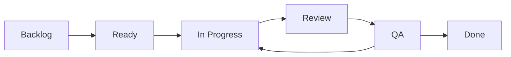

# Backlog

## Estado

El repositorio no tiene issues ni pull requests registrados al momento de la inspeccion. Este backlog queda listo para convertirse en issues de GitHub y organizarse en un tablero Kanban.

## Epicas

| Epica | Objetivo |
| --- | --- |
| EPIC-01 Setup y arquitectura | Base tecnica, rutas, layout y documentacion inicial. |
| EPIC-02 Catalogo | Productos mock, tarjetas y detalle. |
| EPIC-03 Busqueda y filtros | Consulta avanzada de productos. |
| EPIC-04 Autenticacion simulada | Registro, login y sesion local. |
| EPIC-05 Carrito y checkout | Gestion de compra simulada. |
| EPIC-06 Calidad y cierre | Pruebas, responsive, accesibilidad y sustentacion. |

## Tablero Kanban

## Milestones

| Milestone | Semana | Objetivo |
| --- | --- | --- |
| Setup | 1 | Base tecnica y documentacion inicial. |
| Core Features | 2 | Catalogo, tarjetas y detalle. |
| Search & Filters | 3 | Busqueda, filtros y ordenamiento. |
| Auth | 4 | Registro, login y proteccion de checkout. |
| Cart | 5 | Carrito, totales, stock y checkout. |
| Stabilization | 6 | Pruebas, responsive, accesibilidad y deuda tecnica. |
| Final Delivery | 6 | Sustentacion, video y documentacion final. |

## Labels sugeridos

| Label | Uso |
| --- | --- |
| `frontend` | Cambios de UI o comportamiento cliente. |
| `setup` | Configuracion inicial o tooling. |
| `architecture` | Decisiones de estructura y diseno tecnico. |
| `catalog` | Catalogo, tarjetas y detalle. |
| `search` | Busqueda y ordenamiento. |
| `filters` | Filtros de productos. |
| `auth` | Registro, login y sesion simulada. |
| `cart` | Carrito, cantidades y totales. |
| `testing` | Pruebas automatizadas. |
| `qa` | Revision manual y defectos. |
| `documentation` | README, actas, guiones y planeacion. |
| `technical-debt` | Refactor, limpieza y mejoras internas. |

## Tabla de tareas resumida

| ID | Nombre | Prioridad | Semana | Entrega |
| --- | --- | --- | --- | --- |
| TSP-001 | Setup base | Alta | 1 | Entrega 1 |
| TSP-004 | Definir rutas | Alta | 1 | Entrega 1 |
| TSP-008 | Crear mock de productos | Alta | 2 | Entrega 2 |
| TSP-010 | Completar CatalogPage | Alta | 2 | Entrega 2 |
| TSP-013 | Implementar busqueda | Alta | 3 | Entrega 2 |
| TSP-015 | Implementar filtros avanzados | Alta | 3 | Entrega 2 |
| TSP-020 | Store de autenticacion | Alta | 4 | Entrega 2 |
| TSP-022 | Store de carrito | Alta | 5 | Entrega 3 |
| TSP-027 | Completar checkout simulado | Media | 5 | Entrega 3 |
| TSP-028 | Pruebas de filtros | Media | 6 | Entrega 3 |
| TSP-031 | Revision responsive | Alta | 6 | Entrega 3 |
| TSP-035 | Preparar sustentacion | Alta | 6 | Entrega 3 |

## Fuente completa

Ver [backlog base](../planning/backlog.md).
