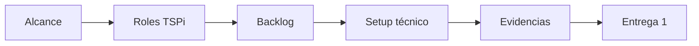

# Entrega 1 - Planeación y base técnica

## Objetivo

Formalizar el proyecto, definir el enfoque TSPi/SDD y dejar una base técnica reproducible.

## Alcance

| Elemento | Resultado esperado | Estado actual |
| --- | --- | --- |
| Definición del proyecto | Objetivo, alcance y exclusiones. | Documentado |
| Roles TSPi | Responsabilidades y seguimiento. | Documentado |
| Cronograma | Roadmap de seis semanas. | Documentado |
| Backlog | Tareas tecnicas priorizadas. | Documentado |
| Arquitectura | Stack, rutas y estructura base. | Documentado |
| Setup técnico | Vite, React, TypeScript, Tailwind, ESLint y Vitest. | Implementado |
| Evidencias | README, commits iniciales y estructura de carpetas. | Disponible |

## Evidencias del repositorio

- Commit `7b5757f`: setup inicial de la tienda React.
- Commit `07ec87a`: README con roadmap inicial.
- Rutas base implementadas en `src/app/App.tsx`.
- Layout principal implementado en `src/app/layouts/MainLayout.tsx`.
- Tipos de dominio definidos en `src/types/domain.ts`.

## Checklist de aceptación

- [x] Proyecto inicializado con Vite, React y TypeScript.
- [x] Tailwind CSS configurado.
- [x] Rutas base creadas.
- [x] Layout principal creado.
- [x] Tipos de dominio iniciales creados.
- [x] Documentación inicial generada.
- [ ] Issues y tablero GitHub creados formalmente.

## Diagrama de cierre

## Riesgos tratados

| Riesgo | Mitigación |
| --- | --- |
| Alcance ambiguo | Se documentan exclusiones y criterios de aceptación. |
| Falta de organización | Se definen roles, reuniones y backlog. |
| Setup no reproducible | Se centralizan scripts en `package.json`. |
