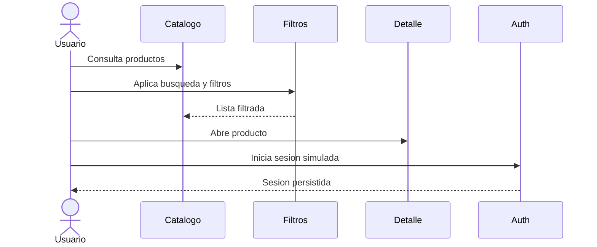

# Entrega 2 - Evolucion funcional

## Objetivo

Consolidar los modulos principales de catalogo, busqueda, filtros y autenticacion simulada, manteniendo registros de avance y QA parcial.

## Alcance planificado

| Modulo | Tareas | Criterio de aceptacion |
| --- | --- | --- |
| Catalogo | Mock data, tarjetas, grilla y detalle. | Minimo 20 productos navegables. |
| Busqueda | Busqueda por nombre. | El resultado cambia segun texto ingresado. |
| Filtros | Categoria, marca, precio, stock y caracteristicas. | Los filtros se pueden combinar sin romper la UI. |
| Auth | Registro, login y persistencia local. | El usuario puede iniciar sesion simulada. |
| Checkout protegido | Bloqueo o redireccion sin sesion. | No se accede al checkout si no hay usuario. |
| QA parcial | Defectos, responsive base y pruebas iniciales. | Checklist parcial registrado. |

## Tareas principales

| ID | Tarea | Semana |
| --- | --- | --- |
| TSP-008 | Crear mock de productos | 2 |
| TSP-009 | Crear componente ProductCard | 2 |
| TSP-010 | Completar CatalogPage | 2 |
| TSP-011 | Completar ProductDetailPage | 2 |
| TSP-013 | Implementar busqueda | 3 |
| TSP-014 | Implementar filtros basicos | 3 |
| TSP-015 | Implementar filtros avanzados | 3 |
| TSP-018 | Formularios de login | 4 |
| TSP-019 | Formularios de registro | 4 |
| TSP-020 | Store de autenticacion | 4 |
| TSP-021 | Proteccion de checkout | 4 |

## Flujo esperado

## QA parcial

- Validar rutas de catalogo y detalle.
- Validar estados sin resultados.
- Validar combinaciones de filtros.
- Validar formularios con datos incompletos.
- Validar persistencia de usuario al recargar.
- Registrar defectos y ajustes en backlog.

## Evidencias esperadas

- Capturas de catalogo y detalle.
- Capturas de filtros activos.
- Capturas de login y registro.
- Commits por modulo.
- Actas de seguimiento.
- Checklist QA parcial.
