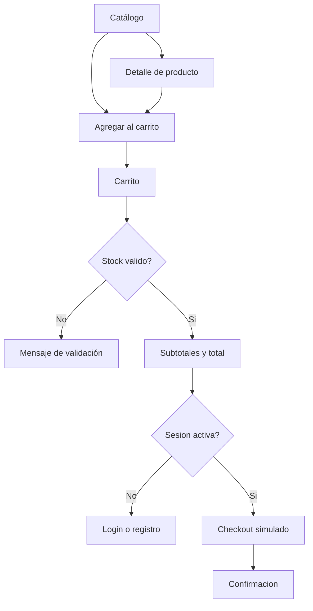

# Entrega 3 - Consolidación, QA y sustentación

## Objetivo

Completar el flujo de compra simulada, estabilizar el producto, cerrar documentación y preparar la sustentación final.

## Alcance planificado

| Area | Resultado esperado |
| --- | --- |
| Carrito | Agregar, eliminar, modificar cantidades y validar stock. |
| Totales | Subtotales por item y total general. |
| Checkout | Resumen y confirmación simulada. |
| Testing | Pruebas de filtros, stores y rutas principales. |
| Responsive | Revisión móvil y escritorio. |
| Accesibilidad | Labels, nombres accesibles, contraste y navegación básica. |
| Sustentación | Línea de tiempo, video final, conclusiones y evidencias. |

## Tareas principales

| ID | Tarea | Semana |
| --- | --- | --- |
| TSP-022 | Store de carrito | 5 |
| TSP-023 | Agregar al carrito | 5 |
| TSP-024 | Editar cantidades | 5 |
| TSP-025 | Validar stock | 5 |
| TSP-026 | Calcular totales | 5 |
| TSP-027 | Completar checkout simulado | 5 |
| TSP-028 | Pruebas de filtros | 6 |
| TSP-029 | Pruebas de stores | 6 |
| TSP-030 | Pruebas de rutas | 6 |
| TSP-031 | Revision responsive | 6 |
| TSP-032 | Revision accesibilidad | 6 |
| TSP-034 | Documentación final | 6 |
| TSP-035 | Preparar sustentación | 6 |

## Flujo final

## Checklist final

- [ ] `pnpm lint` ejecutado.
- [ ] `pnpm build` ejecutado.
- [ ] `pnpm test` ejecutado.
- [ ] Flujo principal probado manualmente.
- [ ] Responsive revisado en móvil y escritorio.
- [ ] Accesibilidad básica revisada.
- [ ] README actualizado.
- [ ] Portal VitePress actualizado.
- [ ] Video final preparado.

## Evidencias esperadas

- Resultados de comandos de calidad.
- Capturas del flujo completo.
- Registro de defectos cerrados.
- Acta de retrospectiva final.
- Guion y enlace de video.
- Conclusiones del proceso TSPi.
