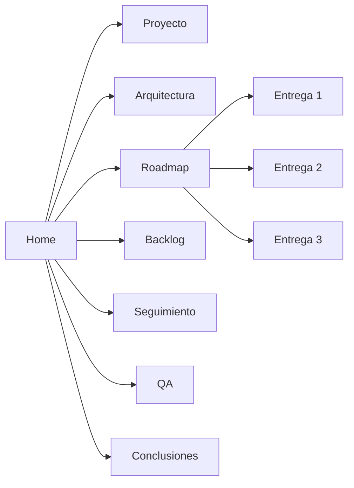

## Estado actual

  

    <strong>Repositorio</strong>
    React, TypeScript, Vite, Tailwind CSS, React Router, Zustand planificado y Vitest.
  

  

    <strong>Implementación</strong>
    Fases 1, 2 y 3 funcionales: base técnica, catálogo, detalle, búsqueda, filtros y ordenamiento.
  

  

    <strong>Gestión</strong>
    Seguimiento semanal registrado hasta el 2026-06-07; Fase 3 se cerró de forma adelantada.
  

## Mapa del portal

## Fuentes principales

La base documental se encuentra en `docs/planning` y fue reorganizada en secciones navegables para consulta técnica, académica y de sustentación.
