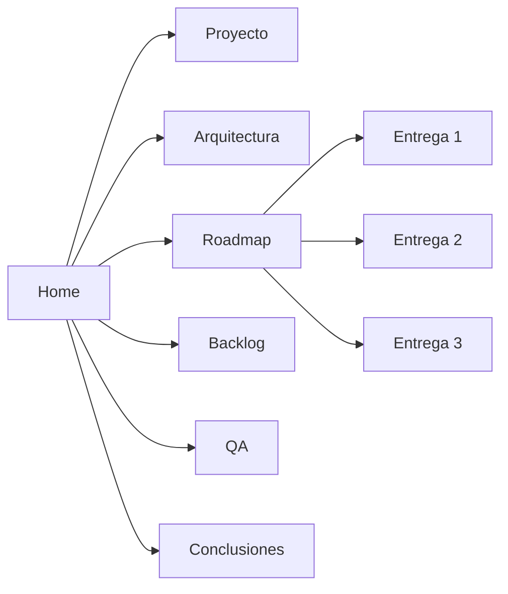

## Estado actual

  

    <strong>Repositorio</strong>
    React, TypeScript, Vite, Tailwind CSS, React Router, Zustand planificado y Vitest.
  

  

    <strong>Implementacion</strong>
    Fase 1 funcional: rutas base, layout, tooling, tipado de dominio y README.
  

  

    <strong>Gestion</strong>
    No existen issues ni PRs remotos; el backlog sugerido queda listo para GitHub Projects.
  

## Mapa del portal

## Fuentes principales

La base documental se encuentra en `docs/planning` y fue reorganizada en secciones navegables para consulta tecnica, academica y de sustentacion.
