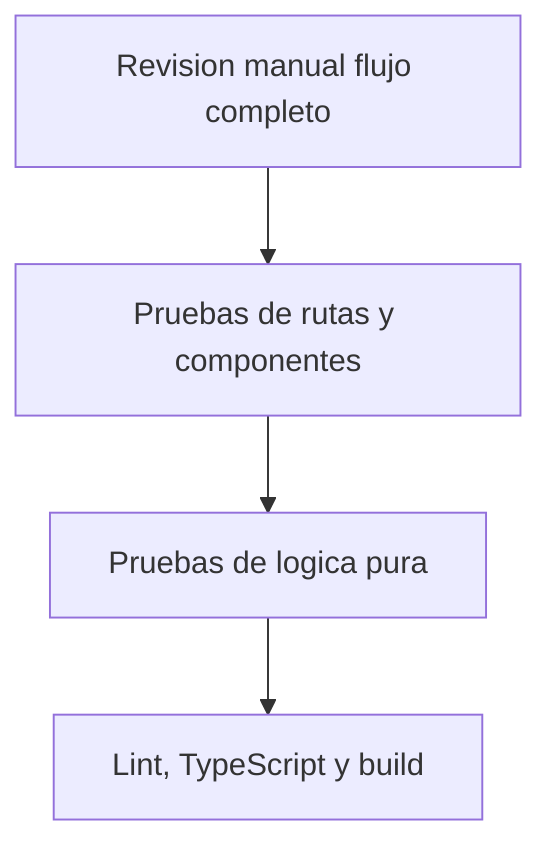

# QA

## Estrategia

La estrategia de calidad combina revisiones manuales, pruebas automatizadas basicas y validaciones de entrega. El objetivo no es cubrir exhaustivamente todos los casos, sino asegurar que el flujo academico principal sea demostrable y estable.

## Piramide de pruebas propuesta

## Comandos de verificacion

| Comando | Proposito |
| --- | --- |
| `pnpm lint` | Validar reglas estaticas. |
| `pnpm build` | Validar compilacion de la app React. |
| `pnpm test` | Ejecutar pruebas con Vitest. |
| `pnpm docs:build` | Validar build del portal VitePress. |

## Casos QA principales

| ID | Caso | Modulo | Resultado esperado |
| --- | --- | --- | --- |
| QA-001 | Abrir catalogo | Routing/Catalogo | La ruta `/` renderiza catalogo. |
| QA-002 | Abrir detalle | Catalogo/Routing | La ruta de producto muestra informacion ampliada. |
| QA-003 | Buscar producto | Busqueda | La lista se filtra por texto. |
| QA-004 | Combinar filtros | Filtros | Los criterios se aplican sin errores. |
| QA-005 | Registrar usuario | Auth | Se guarda usuario simulado. |
| QA-006 | Iniciar sesion | Auth | Se crea sesion local. |
| QA-007 | Acceder checkout sin sesion | Auth/Routing | El sistema bloquea o redirige. |
| QA-008 | Agregar al carrito | Carrito | El item aparece en carrito. |
| QA-009 | Modificar cantidad | Carrito | Subtotal y total se actualizan. |
| QA-010 | Exceder stock | Carrito | Se muestra validacion. |
| QA-011 | Confirmar checkout | Checkout | Se muestra confirmacion simulada. |
| QA-012 | Responsive movil | UI | No hay desbordes ni solapamientos. |

## Definition of Done

- Criterios de aceptacion cumplidos.
- Revisor asignado valida la tarea.
- Lint/build/test ejecutados cuando aplique.
- Defectos criticos cerrados o documentados.
- Evidencia registrada.

## Accesibilidad basica

- Formularios con labels visibles o accesibles.
- Botones con nombre accesible.
- Navegacion por teclado en controles principales.
- Contraste suficiente.
- Estados vacios y errores comprensibles.
