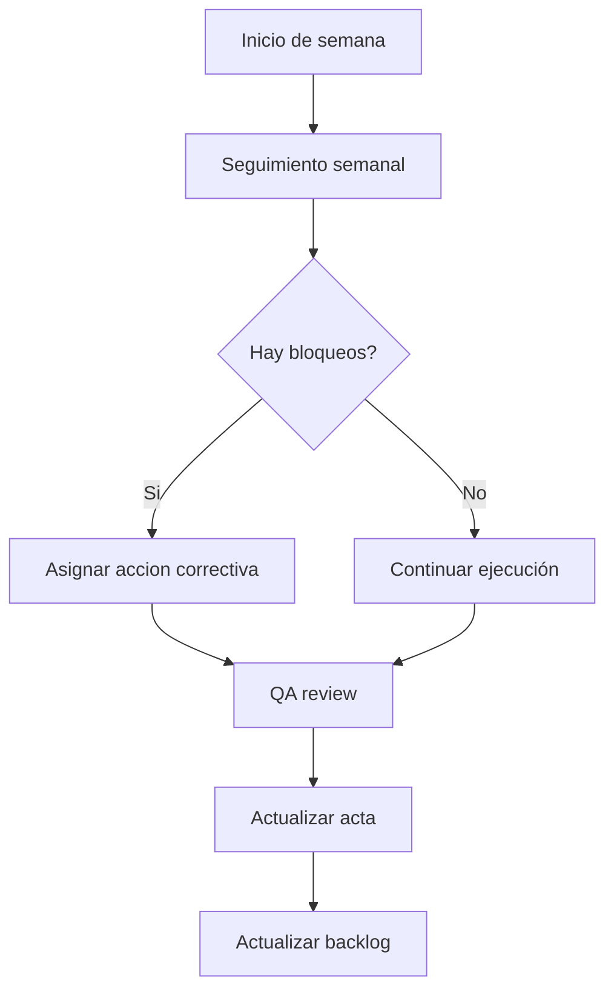

# Reuniones

## Cadencia

| Reunión | Frecuencia | Duración | Participantes |
| --- | --- | --- | --- |
| Launch meeting | Semana 1 | 60 min | Todo el equipo |
| Seguimiento semanal | Semanal | 30 min | Todo el equipo |
| Revisión técnica | Semanal | 30 min | Team Leader, Development Manager, Quality Manager |
| QA review | Semanas 2 a 6 | 30 min | Quality Manager, Development Manager |
| Integracion | Semanas 3 a 6 | 30 min | Development Manager y responsables |
| Retrospectiva | Semanas 3, 5 y 6 | 30 min | Todo el equipo |
| Preparacion de entrega | Antes de cada entrega | 45 min | Todo el equipo |

## Flujo de seguimiento



## Actas resumidas al 2026-06-07

### Semana 1 - 2026-05-13

| Campo | Registro |
| --- | --- |
| Tipo | Launch meeting y planeación TSPi |
| Objetivo | Acordar alcance, roles, stack y entregables. |
| Avances | Proyecto base inicializado, rutas principales y layout definidos. |
| Decisiones | SPA sin backend real, persistencia futura en `localStorage`, seis fases semanales. |
| Riesgos | Alcance amplio para una tienda completa; se acuerda trabajar por incrementos. |
| Evidencias | README, roadmap, backlog y estructura inicial del repositorio. |

### Semana 2 - 2026-05-20

| Campo | Registro |
| --- | --- |
| Tipo | Seguimiento semanal y revisión UI |
| Objetivo | Preparar el módulo de catálogo y detalle. |
| Avances | Se valida contrato `Product`, grilla esperada, navegación a detalle y necesidad de 20 productos mock. |
| Decisiones | Crear `ProductCard`, `products.ts` y utilidad de moneda como piezas separadas. |
| Riesgos | Sin dataset real no se pueden validar filtros ni carrito. |
| Evidencias | Backlog de Fase 2 priorizado. |

### Semana 3 - 2026-05-27

| Campo | Registro |
| --- | --- |
| Tipo | Control de avance y ajuste de dependencias |
| Objetivo | Revisar si el proyecto podía avanzar a filtros. |
| Avances | Se confirma que Fase 3 depende de cerrar catálogo navegable. |
| Decisiones | Mantener búsqueda y filtros en Ready, pero no iniciar hasta tener mock data estable. |
| Riesgos | Desplazamiento del cronograma de Entrega 2. |
| Evidencias | Roadmap ajustado y seguimiento semanal actualizado. |

### Semana 4 - 2026-06-07

| Campo | Registro |
| --- | --- |
| Tipo | Cierre de Fase 2 |
| Objetivo | Completar catálogo y detalle antes de iniciar filtros. |
| Avances | 20 productos mock, `ProductCard`, grilla responsive, detalle por ruta y pruebas iniciales. |
| Decisiones | Reprogramar Fase 3 para el ciclo 2026-06-08 a 2026-06-14. |
| Riesgos | Entrega 2 aún requiere filtros y auth para quedar completa. |
| Evidencias | Código en `src/data`, `src/components/catalog`, `src/pages` y pruebas iniciales. |

## Template de acta

```md
# Acta de reunión

Fecha:
Semana:
Tipo de reunión:
Participantes:

## Objetivo

## Avances revisados

## Decisiones

## Riesgos o bloqueos

## Tareas asignadas

| Tarea | Responsable | Fecha compromiso |
| --- | --- | --- |

## Evidencias

## Próxima reunión
```

## Fuente

Ver [plan de reuniones base](../planning/meetings.md).
