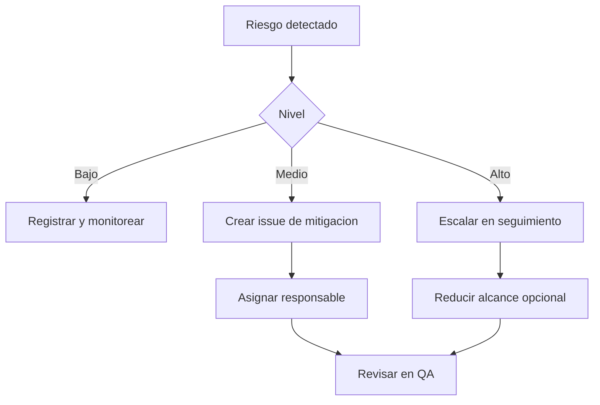

# Riesgos

## Matriz resumida

| ID | Riesgo | Probabilidad | Impacto | Mitigacion |
| --- | --- | --- | --- | --- |
| R-001 | Conflictos Git | Media | Alto | Ramas cortas, division por modulo y revision antes de integrar. |
| R-002 | Retrasos | Media | Alto | Reestimacion semanal y priorizacion del flujo principal. |
| R-003 | Integracion tardia | Media | Alto | Integracion parcial desde semana 3. |
| R-004 | Deuda tecnica | Media | Medio | Extraer componentes, hooks y utilidades cuando exista repeticion real. |
| R-005 | Problemas responsive | Media | Medio | QA responsive semanal y checklist final. |
| R-006 | Testing insuficiente | Alta | Alto | Priorizar filtros, stores y rutas principales. |
| R-007 | Falta de documentacion | Media | Medio | Actas y actualizacion semanal de docs. |
| R-008 | Coordinacion debil | Media | Medio | Responsables por issue y seguimiento de tablero. |

## Mapa de respuesta

## Checklist semanal

- ¿Hay tareas bloqueadas por otra persona?
- ¿Hay archivos compartidos con cambios simultaneos?
- ¿El backlog refleja el estado real?
- ¿El build sigue funcionando?
- ¿Hay defectos criticos sin responsable?
- ¿La documentacion de la semana quedo actualizada?
- ¿La carga semanal es sostenible?

## Fuente

Ver [matriz de riesgos base](../planning/risks.md).
