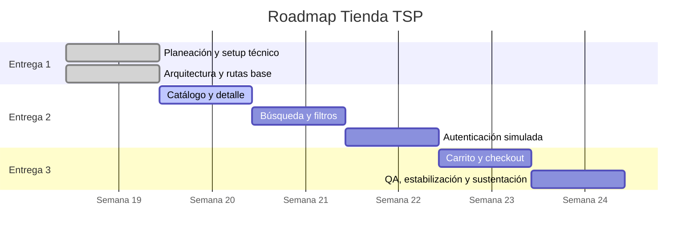

# Roadmap

## Línea de tiempo de 6 semanas

## Roadmap visual

| Semana | Foco | Resultado |
| --- | --- | --- |
| 1 | Planeación, setup y arquitectura | Base técnica funcional y plan TSPi/SDD. |
| 2 | Catálogo y detalle | Mock data, tarjetas y detalle navegable. |
| 3 | Búsqueda y filtros | Catálogo consultable con filtros y ordenamiento. |
| 4 | Autenticación simulada | Registro, login, persistencia y checkout protegido. |
| 5 | Carrito y checkout | Store global, stock, totales y checkout simulado. |
| 6 | QA y sustentación | Pruebas, responsive, accesibilidad, documentación y video. |

## Dependencias principales

## Relación con entregas

| Entrega | Semanas | Contenido |
| --- | --- | --- |
| Entrega 1 | Semana 1 | Definición, roles, arquitectura, backlog, cronograma y setup técnico. |
| Entrega 2 | Semanas 2 a 4 | Catálogo, filtros, auth, registros de avance, defectos y QA parcial. |
| Entrega 3 | Semanas 5 a 6 | Carrito, checkout, pruebas, estabilización, conclusiones y sustentación. |

## Fuente

Ver [roadmap base](../planning/roadmap.md).
